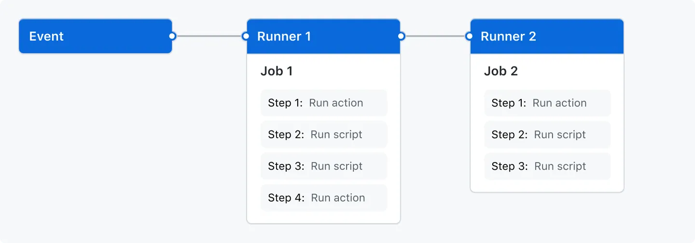

## 📚 GitHub Actions’ı Anlama (understanding GitHub Actions)

GitHub Actions’daki temel kavramların ve önemli terminolojinin temellerini öğrenin.

## 📝 Genel Bakış (overview)

GitHub Actions, sürekli entegrasyon ve sürekli teslim (continuous integration and continuous delivery - CI/CD) platformudur ve derleme (build), test ve dağıtım (deployment) hattınızı otomatikleştirmenizi sağlar. Depo (repository) üzerindeki her çekme isteğini (pull request) derleyen ve test eden veya birleştirilmiş (merged) çekme isteklerini üretime dağıtan iş akışları (workflow) oluşturabilirsiniz.

GitHub Actions, yalnızca DevOps'un ötesine geçerek deponuzda gerçekleşen diğer olaylarda da iş akışları çalıştırmanıza olanak tanır. Örneğin, biri deponuzda yeni bir sorun (issue) oluşturduğunda otomatik olarak uygun etiketleri ekleyen bir iş akışı çalıştırabilirsiniz.

GitHub, iş akışlarınızı çalıştırmak için Linux, Windows ve macOS sanal makineleri sağlar veya kendi veri merkezinize ya da bulut altyapınıza kendi kendine barındırılan koşucularınızı (self-hosted runners) kurabilirsiniz.

## ⚙️ GitHub Actions’ın Bileşenleri (the components of GitHub Actions)

Bir GitHub Actions iş akışını, deponuzda bir olay gerçekleştiğinde (örneğin bir çekme isteğinin açılması veya bir sorunun oluşturulması) tetiklenecek şekilde yapılandırabilirsiniz.

İş akışınız, ardışık sırayla veya paralel olarak çalışabilen bir veya birden fazla iş (job) içerir. Her iş kendi sanal makine koşucusunda (virtual machine runner) veya bir konteyner (container) içinde çalışır ve sizin tanımladığınız bir betiği (script) çalıştıran veya iş akışınızı basitleştiren yeniden kullanılabilir bir uzantı olan eylemi (action) çalıştıran bir veya daha fazla adımdan (step) oluşur.

## ⚙️ İş Akışları (workflows)

Bir iş akışı (workflow), bir veya daha fazla işi (job) çalıştıracak şekilde yapılandırılabilen otomatikleştirilmiş bir süreçtir. İş akışları, deponuza (repository) eklenmiş bir YAML dosyasıyla tanımlanır ve deponuzdaki bir olay tarafından tetiklendiğinde, manuel olarak veya tanımlanmış bir zaman çizelgesinde çalıştırılabilir.

İş akışları, bir deponun `.github/workflows` dizininde tanımlanır. Bir depoda, her biri farklı görevler gerçekleştirebilecek birden fazla iş akışı bulunabilir, örneğin:

- Çekme isteklerini (pull request) derlemek ve test etmek
- Her sürüm (release) oluşturulduğunda uygulamanızı dağıtmak
- Yeni bir sorun (issue) açıldığında etiket eklemek

Bir iş akışına başka bir iş akışında referans verebilirsiniz. Daha fazla bilgi için bkz. `Reuse workflows`.

Daha fazla bilgi için bkz. `Writing workflows`.

## 🧭 Olaylar (events)

Olay (event), bir iş akışının çalışmasını tetikleyen, bir depodaki belirli bir etkinliktir. Örneğin, bir etkinlik, birisinin bir çekme isteği (pull request) oluşturması, bir sorun (issue) açması veya bir depoya bir commit göndermesi olabilir. Ayrıca bir iş akışını zamanlanmış olarak, bir REST API üzerinden veya manuel olarak tetikleyebilirsiniz.

İş akışlarını tetiklemek için kullanılabilecek olayların tam listesi için bkz. `Events that trigger workflows`.

## 🧩 İşler (jobs)

Bir iş (job), aynı koşucu (runner) üzerinde yürütülen adımların (step) bir kümesidir. Her adım ya çalıştırılacak bir kabuk betiği (shell script) ya da çalıştırılacak bir eylemdir (action). Adımlar sırayla yürütülür ve birbirine bağımlıdır. Her adım aynı koşucuda çalıştığından, bir adımdan diğerine veri paylaşabilirsiniz. Örneğin, uygulamanızı oluşturan bir adımı, ardından oluşturulan uygulamayı test eden bir adım izleyebilir.

Bir işin diğer işler ile bağımlılıklarını yapılandırabilirsiniz; varsayılan olarak işler bağımlı değildir ve paralel çalışır. Bir iş başka bir işe bağımlı olduğunda, çalıştırılmadan önce o işin tamamlanmasını bekler.

Ayrıca, aynı işi farklı değişken kombinasyonlarıyla (örneğin işletim sistemleri veya dil sürümleri) birden çok kez çalıştırmak için bir matris (matrix) kullanabilirsiniz.

Daha fazla bilgi için bkz. `Choosing what your workflow does`.

## 🧩 Eylemler (actions)

Bir eylem (action), iş akışınızda belirli görevleri gerçekleştiren ve iş akışı dosyalarınızdaki tekrarlayan kod miktarını azaltan önceden tanımlanmış, yeniden kullanılabilir bir iş veya kod kümesidir. Eylemler şu görevleri gerçekleştirebilir:

- GitHub’dan Git deponuzu almak
- Derleme ortamınız için doğru araç zincirini (toolchain) kurmak
- Bulut sağlayıcınıza kimlik doğrulama (authentication) ayarlamak

Kendi eylemlerinizi yazabilir veya iş akışlarınızda kullanmak üzere GitHub Marketplace’te eylemler bulabilirsiniz.

Eylemler hakkında daha fazla bilgi için bkz. `Reusing automations`.

## 🖥️ Koşucular (runners)

Bir koşucu (runner), tetiklendiğinde iş akışlarınızı çalıştıran bir sunucudur. Her koşucu aynı anda yalnızca tek bir iş çalıştırabilir. GitHub, iş akışlarınızı çalıştırmak için Ubuntu Linux, Microsoft Windows ve macOS koşucuları sağlar. Her iş akışı çalıştırması, yeni sağlanmış (provisioned) temiz bir sanal makinede gerçekleştirilir.

GitHub ayrıca daha büyük yapılandırmalarla kullanılabilen büyük koşucular (larger runners) da sunar. Daha fazla bilgi için bkz. `Using larger runners`.

Farklı bir işletim sistemine veya belirli bir donanım yapılandırmasına ihtiyacınız varsa, kendi koşucularınızı barındırabilirsiniz.

Kendi kendine barındırılan koşucular (self-hosted runners) hakkında daha fazla bilgi için bkz. `Managing self-hosted runners`.

---

## 🔜 Sonraki Adımlar (next steps)

GitHub Actions, uygulama geliştirme süreçlerinizin neredeyse her yönünü otomatikleştirmenize yardımcı olabilir. Başlamaya hazırsınız; sonraki adımlar için kaynaklara bakın:

- Bir GitHub Actions iş akışı oluşturmak için bkz. `Using workflow templates`.
- Sürekli entegrasyon (CI) iş akışları için bkz. `Building and testing your code`.
- Paket oluşturma ve yayınlama için bkz. `Publishing packages`.
- Projeleri dağıtmak için bkz. `Deploying to third-party platforms`.
