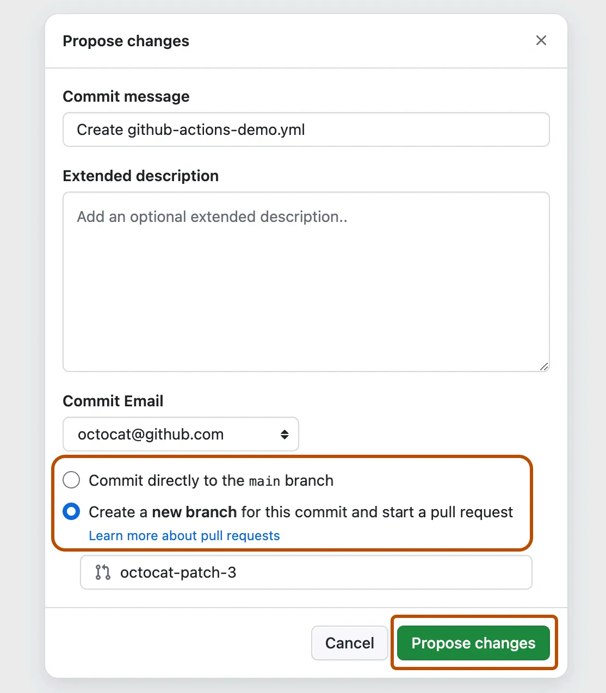
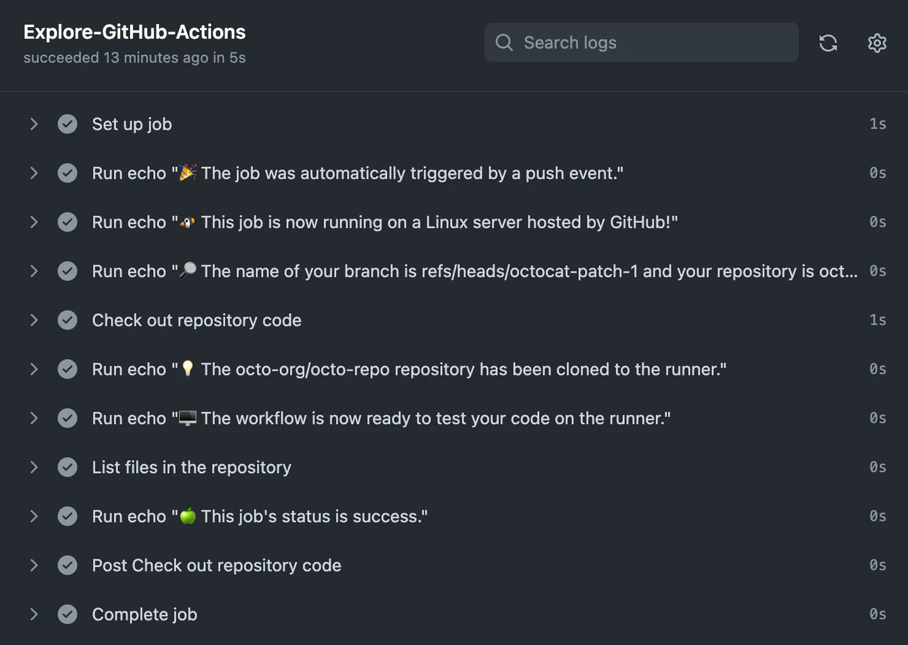
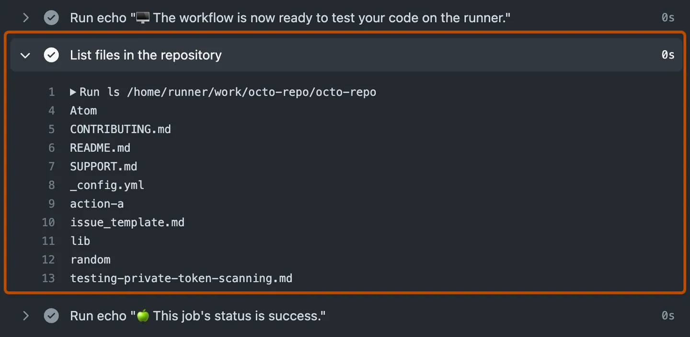

## ⚡ GitHub Actions için Hızlı Başlangıç (Quickstart for GitHub Actions)

GitHub Actions’ın temel özelliklerini dakikalar içinde deneyin.

---

## 📖 Giriş (Introduction)

GitHub Actions, yapı (build), test ve dağıtım (deployment) hattınızı otomatikleştirmenizi sağlayan sürekli entegrasyon ve sürekli teslim (CI/CD – Continuous Integration / Continuous Delivery) platformudur.

Bir iş akışı (workflow) oluşturabilir ve bu iş akışını, depoya her değişiklik gönderildiğinde testleri çalıştıracak veya birleştirilen çekme isteklerini (pull request) üretime dağıtacak şekilde ayarlayabilirsiniz.

Bu hızlı başlangıç kılavuzu, GitHub kullanıcı arayüzünü kullanarak GitHub Actions’ın temel özelliklerini gösteren bir iş akışı eklemeyi öğretir.

Önceden yapılandırılmış iş akışlarıyla başlamak için `actions/starter-workflows` deposundaki şablonlar listesini inceleyin. Daha fazla bilgi için bkz. *Using workflow templates*.

GitHub Actions iş akışlarına genel bir bakış için bkz. *Workflows*. GitHub Actions’ı oluşturan çeşitli bileşenler hakkında bilgi edinmek için bkz. *Understanding GitHub Actions*.

---

## 📝 İş akışı şablonlarını kullanma (Using workflow templates)

GitHub, doğrudan kullanabileceğiniz veya özelleştirerek kendi iş akışınızı oluşturabileceğiniz önceden yapılandırılmış iş akışı şablonları sunar.

GitHub, kodunuzu analiz eder ve deponuz için faydalı olabilecek iş akışı şablonlarını gösterir. Örneğin, deponuz Node.js kodu içeriyorsa, Node.js projeleri için öneriler görürsünüz.

Bu iş akışı şablonları hızlıca başlamanıza yardımcı olmak için tasarlanmıştır ve şu yapılandırmaları sunar:

* CI (Continuous Integration) iş akışları
* Dağıtım (Deployment) iş akışları
* Otomasyon (Automation) iş akışları
* Kod taraması (Code Scanning) iş akışları
* Pages iş akışları

Bu iş akışlarını özelleştirilmiş iş akışınızı oluşturmak için başlangıç noktası olarak kullanabilir veya olduğu gibi kullanabilirsiniz.

Tüm iş akışı şablonlarının tam listesine `actions/starter-workflows` deposundan ulaşabilirsiniz.

---

## ✅ Önkoşullar (Prerequisites)

Bu kılavuz şunları varsayar:

* GitHub kullanımı hakkında en az temel bilgiye sahipsiniz. Eğer yoksa, öncelikle depolar (repositories) ve çekme istekleri (pull requests) ile ilgili belgeleri okumanız faydalı olacaktır. Örn. *Quickstart for repositories*, *About branches*, *About pull requests*.
* Dosya ekleyebileceğiniz bir GitHub deponuz var.
* GitHub Actions’a erişiminiz var.

**Not:** Eğer deponuzun üst kısmında **Actions** sekmesi görünmüyorsa, bu Actions özelliğinin depo için devre dışı bırakılmış olmasından kaynaklanabilir. Daha fazla bilgi için bkz. *Managing GitHub Actions settings for a repository*.

---

## 🚀 İlk iş akışınızı oluşturma (Creating your first workflow)

GitHub’daki deponuzda, `.github/workflows` dizininde `github-actions-demo.yml` adında bir iş akışı dosyası oluşturun.

Bunu yapmak için:

* Eğer `.github/workflows` dizini zaten varsa, GitHub’da bu dizine gidin, **Add file** → **Create new file** seçeneğine tıklayın ve dosya adını `github-actions-demo.yml` olarak girin.
* Eğer deponuzda `.github/workflows` dizini yoksa, deponuzun ana sayfasına gidin, **Add file** → **Create new file** seçeneğine tıklayın ve dosya adını `.github/workflows/github-actions-demo.yml` olarak girin. Bu işlem hem `.github` hem de `workflows` dizinlerini ve dosyayı tek adımda oluşturur.

**Not:** GitHub’ın deponuzdaki herhangi bir GitHub Actions iş akışını keşfedebilmesi için iş akışı dosyalarını `.github/workflows` dizininde saklamanız gerekir.

İş akışı dosyasına istediğiniz adı verebilirsiniz, ancak dosya uzantısı `.yml` veya `.yaml` olmalıdır. YAML, genellikle yapılandırma dosyalarında kullanılan bir işaretleme dilidir.

Aşağıdaki YAML içeriğini `github-actions-demo.yml` dosyasına kopyalayın:

``` 
name: GitHub Actions Demo
run-name: ${{ github.actor }} is testing out GitHub Actions 🚀
on: [push]
jobs:
  Explore-GitHub-Actions:
    runs-on: ubuntu-latest
    steps:
      - run: echo "🎉 The job was automatically triggered by a ${{ github.event_name }} event."
      - run: echo "🐧 This job is now running on a ${{ runner.os }} server hosted by GitHub!"
      - run: echo "🔎 The name of your branch is ${{ github.ref }} and your repository is ${{ github.repository }}."
      - name: Check out repository code
        uses: actions/checkout@v4
      - run: echo "💡 The ${{ github.repository }} repository has been cloned to the runner."
      - run: echo "🖥️ The workflow is now ready to test your code on the runner."
      - name: List files in the repository
        run: |
          ls ${{ github.workspace }}
      - run: echo "🍏 This job's status is ${{ job.status }}."

``` 

## 📂 İş akışı dosyasını ekleme (Adding the workflow file)

Bu aşamada iş akışının (workflow) ayrıntılarını anlamanız gerekmez. Şimdilik yalnızca içeriği kopyalayıp dosyaya yapıştırabilirsiniz.

Bu hızlı başlangıç kılavuzunu tamamladıktan sonra, iş akışı dosyalarının sözdizimi (syntax) hakkında *Workflows* bölümünden bilgi edinebilir ve `${{ github.actor }}` ile `${{ github.event_name }}` gibi GitHub Actions bağlamlarının (contexts) açıklaması için *Contexts reference* sayfasına bakabilirsiniz.

**Commit changes** düğmesine tıklayın.

**Propose changes** iletişim kutusunda, değişiklikleri varsayılan dalda (default branch) commit etme veya yeni bir dal oluşturup bir çekme isteği (pull request) başlatma seçeneklerinden birini seçin. Ardından **Commit changes** veya **Propose changes** düğmesine tıklayın.



## 🔄 İş akışı dosyasını commit etme (Committing the workflow file)

Depodaki bir dala (branch) iş akışı dosyasını commit etmek, **push** olayını (event) tetikler ve iş akışınızı çalıştırır.

Eğer bir çekme isteği (pull request) başlatmayı seçtiyseniz, devam edip çekme isteğini oluşturabilirsiniz, ancak bu hızlı başlangıç için gerekli değildir. Çünkü commit zaten bir dala yapılmış olacak ve yeni iş akışını tetikleyecektir.

---

## 📊 İş akışı sonuçlarını görüntüleme (Viewing your workflow results)

GitHub’da deponuzun ana sayfasına gidin.

Depo adınızın altında **Actions** sekmesine tıklayın.


Sol kenar çubuğunda, görüntülemek istediğiniz iş akışına tıklayın. Bu örnekte, **"GitHub Actions Demo"**.


İş akışı çalıştırmaları (workflow runs) listesinden, görmek istediğiniz çalıştırmanın adına tıklayın. Bu örnekte, **"USERNAME is testing out GitHub Actions."**

İş akışı çalıştırma sayfasının sol kenar çubuğunda, **Jobs** bölümünün altında **Explore-GitHub-Actions** işine (job) tıklayın.


Günlük (log), her adımın nasıl işlendiğini gösterir. Ayrıntılarını görmek için herhangi bir adımı genişletin.



Örneğin, deponuzdaki dosyaların listesini görebilirsiniz:



## 📌 Örnek iş akışı (Example workflow)

Az önce eklediğiniz örnek iş akışı, dala her kod gönderildiğinde (push) tetiklenir ve GitHub Actions’ın deponuzdaki içeriklerle nasıl çalışabileceğini gösterir. Ayrıntılı bir eğitim için bkz. *Understanding GitHub Actions*.

---

## 🔜 Sonraki adımlar (Next steps)

GitHub Actions, uygulama geliştirme süreçlerinizin neredeyse her yönünü otomatikleştirmenize yardımcı olabilir. Başlamaya hazır mısınız? İşte sonraki adımlarınız için bazı yararlı kaynaklar:

* Bir GitHub Actions iş akışı oluşturmak için bkz. *Using workflow templates*.
* Sürekli entegrasyon (CI) iş akışları için bkz. *Building and testing your code*.
* Paketleri oluşturmak ve yayımlamak için bkz. *Publishing packages*.
* Projeleri dağıtmak için bkz. *Deploying to third-party platforms*.
* GitHub’daki görevleri ve süreçleri otomatikleştirmek için bkz. *Managing your work with GitHub Actions*.
* GitHub Actions’ın daha karmaşık özelliklerini gösteren örnekler için bkz. *Managing your work with GitHub Actions*. Bu ayrıntılı örnekler, kodunuzu bir koşucu (runner) üzerinde nasıl test edeceğinizi, GitHub CLI’a nasıl erişeceğinizi ve eşzamanlılık (concurrency) ile test matrisleri (test matrices) gibi gelişmiş özellikleri nasıl kullanacağınızı açıklar.
* İş akışlarını otomatikleştirme ve geliştirmeyi hızlandırmadaki yetkinliğinizi belgelendirmek için GitHub Actions sertifikası alabilirsiniz. Daha fazla bilgi için bkz. *About GitHub Certifications*.
