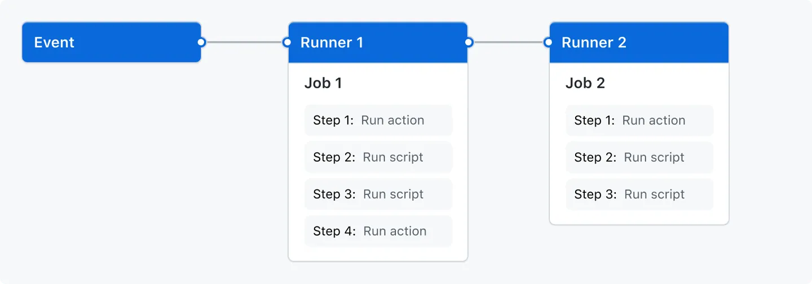

## 🛠️ İş Akışları (workflows)

GitHub Actions iş akışlarına (workflow) genel bir bakış edinin; tetikleyiciler (triggers), sözdizimi (syntax) ve gelişmiş özellikler dâhil.

### 📋 Bu makalede

* İş akışları hakkında
* İş akışı temelleri

---

## ℹ️ İş Akışları Hakkında (about workflows)

Bir iş akışı (workflow), bir veya birden fazla işi (job) çalıştıracak şekilde yapılandırılabilen otomatik bir süreçtir. İş akışları, deponuza işlenen bir `YAML` dosyası ile tanımlanır ve deponuzda bir olay (event) tetiklendiğinde, manuel olarak veya belirlenmiş bir zamanlama ile çalıştırılabilir.

İş akışları, bir deponun `.github/workflows` dizininde tanımlanır. Bir depoda, her biri farklı görevler gerçekleştirebilen birden fazla iş akışı bulunabilir. Örneğin:

* Pull request’leri derlemek (build) ve test etmek
* Her yeni sürüm (release) oluşturulduğunda uygulamanızı dağıtmak (deploy)
* Yeni bir issue açıldığında bir etiket (label) eklemek

---

## 📐 İş Akışı Temelleri (workflow basics)

Bir iş akışı şu temel bileşenleri içermelidir:

* İş akışını tetikleyecek bir veya birden fazla olay (event).
* Her biri bir `runner` makinesinde çalışacak ve bir veya daha fazla adım (step) yürütecek bir veya daha fazla iş (job).
* Her adım, sizin tanımladığınız bir betiği (script) çalıştırabilir veya iş akışınızı basitleştiren, yeniden kullanılabilir bir uzantı olan bir `action` çalıştırabilir.

Bu temel bileşenler hakkında daha fazla bilgi için bkz. `Understanding GitHub Actions`.

## 🔔 İş Akışı Tetikleyicileri (workflow triggers)

İş akışı tetikleyicileri (workflow triggers), bir iş akışının çalışmasına neden olan olaylardır. Bu olaylar şunlar olabilir:

* İş akışınızın deposunda meydana gelen olaylar
* GitHub dışında meydana gelen ve GitHub’da `repository_dispatch` olayını tetikleyen olaylar
* Zamanlanmış çalıştırmalar (scheduled times)
* Manuel çalıştırma

Örneğin, iş akışınızı deponuzun varsayılan dalına (default branch) bir `push` yapıldığında, bir `release` oluşturulduğunda veya bir `issue` açıldığında çalışacak şekilde yapılandırabilirsiniz.

İş akışı tetikleyicileri `on` anahtarı ile tanımlanır. Daha fazla bilgi için bkz. `Workflow syntax for GitHub Actions`.

---

## ⚙️ Bir İş Akışı Çalıştırmasını Tetikleme Süreci

1. Depoda bir olay meydana gelir. Bu olayla ilişkili bir `commit SHA` ve `Git ref` vardır.
2. GitHub, deponuzun kökündeki `.github/workflows` dizininde, olayın `commit SHA` veya `Git ref` değerinde mevcut olan iş akışı dosyalarını arar.
3. `on:` değerleri tetikleyici olayla eşleşen tüm iş akışları için bir iş akışı çalıştırması tetiklenir. Bazı olaylar ayrıca iş akışı dosyasının deponun varsayılan dalında mevcut olmasını gerektirir.
4. Her iş akışı çalıştırması, olayın ilişkili olduğu `commit SHA` veya `Git ref` üzerinde bulunan iş akışı sürümünü kullanır. Bir iş akışı çalıştırıldığında, GitHub `runner` ortamında `GITHUB_SHA` (commit SHA) ve `GITHUB_REF` (Git ref) ortam değişkenlerini ayarlar. Daha fazla bilgi için bkz. `Store information in variables`.

Daha fazla bilgi için bkz. `Triggering a workflow`.

---

## 🚀 Sonraki Adımlar (next steps)

İlk iş akışınızı oluşturmak için bkz. `Creating an example workflow`.

