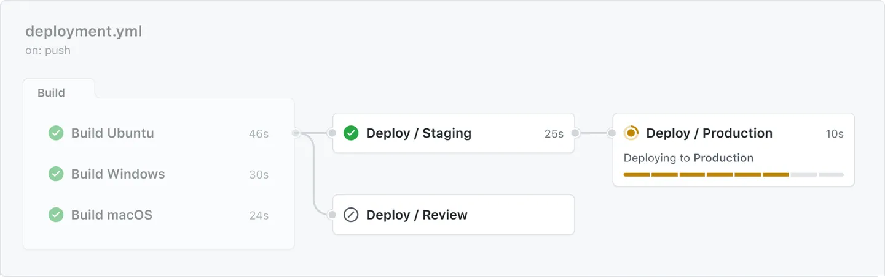

## 🔄 Yeniden Kullanılabilir İş Akışları (reusable workflows)

Bir iş akışı (workflow) oluştururken mevcut iş akışlarını yeniden kullanarak yinelenmeden (duplication) nasıl kaçınabileceğinizi öğrenin.

## ℹ️ Yeniden kullanılabilir iş akışları hakkında (about reusable workflows)

Bir iş akışından diğerine kopyalayıp yapıştırmak yerine iş akışlarını yeniden kullanılabilir hale getirebilirsiniz. Siz ve yeniden kullanılabilir iş akışına erişimi olan herkes bu iş akışını başka bir iş akışından çağırabilir.

İş akışlarını yeniden kullanmak, yinelenmeyi önler. Bu, iş akışlarını daha kolay bakım yapılabilir hale getirir ve başkalarının çalışmaları üzerine inşa ederek (tıpkı actions kullanırken olduğu gibi) yeni iş akışları oluşturmayı hızlandırır. İş akışlarını yeniden kullanmak ayrıca iyi tasarlanmış, test edilmiş ve etkili olduğu kanıtlanmış iş akışlarını kullanmanıza yardımcı olarak en iyi uygulamaları teşvik eder. Organizasyonunuz merkezi olarak yönetilebilecek yeniden kullanılabilir iş akışlarından oluşan bir kütüphane oluşturabilir.

Aşağıdaki diyagram, yeniden kullanılabilir bir iş akışı kullanan devam eden bir iş akışı çalıştırmasını göstermektedir.

* Soldaki üç derleme işinden (build jobs) her biri başarıyla tamamlandıktan sonra, "Deploy" adlı bağımlı bir iş çalıştırılır.
* "Deploy" işi, "Staging", "Review" ve "Production" adında üç iş içeren yeniden kullanılabilir bir iş akışını çağırır.
* "Production" dağıtım işi yalnızca "Staging" işi başarıyla tamamlandıktan sonra çalıştırılır.
* Bir iş bir ortamı (environment) hedeflediğinde, iş akışı çalıştırması işteki adım sayısını gösteren bir ilerleme çubuğu görüntüler. Aşağıdaki diyagramda, "Production" işinde 8 adım vardır ve şu anda 6. adım işlenmektedir.
* Dağıtım işlerini çalıştırmak için yeniden kullanılabilir bir iş akışı kullanmak, bu işleri her derleme için yinelenen kod olmadan çalıştırmanıza olanak tanır.

Bir iş akışının başka bir iş akışını kullanmasına "çağıran" iş akışı (caller workflow) denir. Yeniden kullanılabilir iş akışı ise "çağrılan" iş akışı (called workflow) olarak adlandırılır. Bir çağıran iş akışı birden fazla çağrılan iş akışını kullanabilir. Her çağrılan iş akışı tek satırda referans alınır. Sonuç olarak, çağıran iş akışı dosyası yalnızca birkaç satır YAML içerebilir ancak çalıştırıldığında çok sayıda görev yerine getirilebilir. Bir iş akışını yeniden kullandığınızda, çağrılan iş akışının tamamı çağıran iş akışının bir parçasıymış gibi kullanılır.

Farklı bir depodan (repository) bir iş akışı yeniden kullanılırsa, çağrılan iş akışındaki tüm işlemler çağıran iş akışının bir parçasıymış gibi çalıştırılır. Örneğin, çağrılan iş akışı `actions/checkout` kullanıyorsa, bu işlem çağıran iş akışını barındıran deponun içeriğini çeker, çağrılan iş akışınınkini değil.

Yeniden kullanılan iş akışlarını, iş akışlarınızı içeren deponun bağımlılık grafiğinde (dependency graph) bağımlılıklar olarak görüntüleyebilirsiniz. Daha fazla bilgi için bkz. Bağımlılık grafiği hakkında (About the dependency graph).

## ⚖️ Yeniden kullanılabilir iş akışları ve bileşik işlemler (composite actions)

Yeniden kullanılabilir iş akışları ve bileşik işlemler (composite actions), iş akışı içeriğini yinelemekten kaçınmanıza yardımcı olur. Yeniden kullanılabilir iş akışları birden çok iş (jobs) ve adımı (steps) olan tüm bir iş akışını yeniden kullanmanıza olanak tanırken, bileşik işlemler bir iş adımı (job step) içinde çalıştırabileceğiniz birden çok adımı birleştirir.

Karşılaştırma:

* **İş akışı işleri (workflow jobs):** Bileşik işlemler (composite actions), çağıran iş akışı içinde tek bir adım olarak çalıştırılan bir dizi adım içerir. Yeniden kullanılabilir iş akışlarının aksine, işler (jobs) içeremezler.
* **Günlükleme (logging):** Bir bileşik işlem çalıştığında, günlük yalnızca çağıran iş akışındaki bileşik işlemi çalıştıran adımı gösterir, içindeki bireysel adımları göstermez. Yeniden kullanılabilir iş akışlarında her iş ve adım ayrı ayrı günlüğe kaydedilir.
* **Koşucuların belirtilmesi (specifying runners):** Yeniden kullanılabilir iş akışları bir veya daha fazla iş içerir. Tüm iş akışları işlerindeki gibi, yeniden kullanılabilir iş akışındaki işler de çalıştırılacağı makine türünü belirtir. Bu nedenle, adımlar çağıran iş akışı işinde seçilen makineden farklı bir türde çalıştırılmak zorundaysa, bileşik işlem yerine yeniden kullanılabilir iş akışı kullanılmalıdır.
* **Çıktıların adımlara aktarılması (passing output to steps):** Bileşik işlem bir iş adımı olarak çalıştırılır ve bu adımın öncesinde veya sonrasında birden fazla adım bulunabilir. Yeniden kullanılabilir iş akışları bir iş içinde doğrudan çağrılır, bir iş adımı içinde değil. Bir işte yeniden kullanılabilir bir iş akışını çağırdıktan sonra adım ekleyemezsiniz, bu nedenle çağıran iş akışındaki sonraki adımlara değer aktarmak için `GITHUB_ENV` kullanamazsınız.

### 🔑 Temel farklar (key differences)

| Yeniden kullanılabilir iş akışları (Reusable workflows)  | Bileşik işlemler (Composite actions)                           |
| -------------------------------------------------------- | -------------------------------------------------------------- |
| Standart bir iş akışı dosyasına çok benzer YAML dosyası  | `action.yml` dosyası içeren ayrı bir depo veya dizin           |
| Her biri `.github/workflows` dizininde tek dosya         | Ayrı bir depo veya dizin                                       |
| Belirli bir YAML dosyasına referansla çağrılır           | İşlemin tanımlandığı depo veya dizine referansla çağrılır      |
| Bir iş (job) içinde doğrudan çağrılır, bir adımdan değil | Bir iş adımı içinde çalıştırılır                               |
| Birden fazla iş içerebilir                               | İş içermez                                                     |
| Her adım gerçek zamanlı günlüğe kaydedilir               | Birden çok adım olsa bile tek adım olarak günlüğe kaydedilir   |
| Maksimum dört düzeyde iş akışını bağlayabilir            | Bir iş akışında 10’a kadar bileşik işlem iç içe kullanılabilir |
| Sırlar (secrets) kullanılabilir                          | Sırlar kullanılamaz                                            |

## 🧩 Yeniden kullanılabilir iş akışları ve iş akışı şablonları (workflow templates)

İş akışı şablonları (workflow templates), organizasyonunuzdaki iş akışı oluşturma iznine sahip herkesin daha hızlı ve kolay iş akışı oluşturmasını sağlar. Yeni bir iş akışı oluştururken bir iş akışı şablonu seçebilir ve işin bir kısmı veya tamamı otomatik olarak hazırlanabilir. Bir iş akışı şablonunda ayrıca yeniden kullanılabilir iş akışlarına referans vererek, insanların merkezi olarak yönetilen iş akışı kodunu yeniden kullanmasından faydalanmasını kolaylaştırabilirsiniz.

Yeniden kullanılabilir iş akışına referans verirken bir commit SHA kullanırsanız, bu iş akışını yeniden kullanan herkesin her zaman aynı YAML kodunu kullanmasını sağlayabilirsiniz. Ancak, bir etikete (tag) veya dala (branch) referans verirseniz, bu iş akışının sürümüne güvenebileceğinizden emin olmalısınız. Daha fazla bilgi için bkz. Güvenli kullanım başvurusu (Secure use reference).

GitHub, çeşitli diller ve araçlar için iş akışı şablonları sunar. Depoda iş akışlarını ayarlarken GitHub, deponuzdaki kodu analiz eder ve dil ve çerçeveye (framework) dayalı olarak iş akışlarını önerir. Örneğin, Node.js kullanıyorsanız, GitHub Node.js paketlerini yükleyen ve testleri çalıştıran bir iş akışı şablonu dosyası önerir. İlgili iş akışı şablonlarını bulmak için arama ve filtreleme yapabilirsiniz.

GitHub, aşağıdaki üst düzey kategoriler için kullanıma hazır iş akışı şablonları sağlar:

* **Dağıtım (CD)** – Daha fazla bilgi için bkz. Sürekli dağıtım (Continuous deployment).
* **Güvenlik (Security)** – Daha fazla bilgi için bkz. Kod taraması için gelişmiş yapılandırma (Configuring advanced setup for code scanning).
* **Sürekli entegrasyon (CI)** – Daha fazla bilgi için bkz. Sürekli entegrasyon (Continuous integration).
* **Otomasyon (Automation)** – Örneğin, pull request’leri sınıflandırmak, değiştirilen yollar temelinde etiket uygulamak veya ilk kez katkıda bulunan kullanıcıları karşılamak gibi iş akışlarını otomatikleştirmeye yönelik çözümler.

Bu iş akışlarını özel iş akışınızı oluşturmak için başlangıç noktası olarak kullanabilir veya olduğu gibi kullanabilirsiniz. İş akışı şablonlarının tam listesini `actions/starter-workflows` deposunda inceleyebilirsiniz.

Daha fazla bilgi için bkz. Organizasyonunuz için iş akışı şablonları oluşturma (Creating workflow templates for your organization).

## ⏭️ Sonraki adımlar (next steps)

* Yeniden kullanılabilir iş akışlarını kullanmaya başlamak için bkz. İş akışlarını yeniden kullanma (Reuse workflows).
* İş akışlarını yeniden kullanmanın ayrıntıları hakkında bilgi için bkz. Yeniden kullanılabilir iş akışları başvurusu (Reusable workflows reference).
