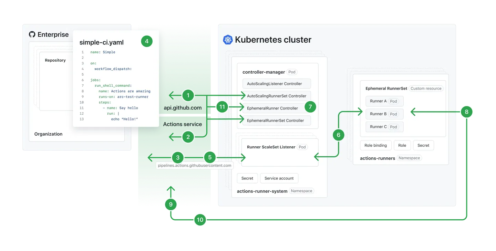

## ⚙️ Actions Runner Controller (ARC)

Kendi runner’ınızı barındırabilir ve GitHub Actions iş akışlarınızda (workflows) işleri (jobs) çalıştırmak için kullanılan ortamı özelleştirebilirsiniz.

---

## 📌 Actions Runner Controller hakkında (About Actions Runner Controller)

Actions Runner Controller (ARC), GitHub Actions için self-hosted runner’ları düzenleyen (orchestrate) ve ölçeklendiren bir Kubernetes operatörüdür. Daha fazla bilgi için bkz. Kubernetes belgelerindeki *Operator pattern*.

ARC ile, havuzunuzda (repository), organizasyonunuzda veya işletmenizde çalışan iş akışlarının sayısına göre otomatik olarak ölçeklenen runner ölçek kümeleri (runner scale sets) oluşturabilirsiniz. Denetlenen runner’lar geçici (ephemeral) ve konteyner tabanlı olabileceğinden, yeni runner örnekleri hızlı ve temiz bir şekilde artırılabilir veya azaltılabilir. Otomatik ölçeklendirme hakkında daha fazla bilgi için bkz. Self-hosted runners reference.

Aşağıdaki diyagram, ARC’nin otomatik ölçeklendirme runner ölçek kümesi modunun mimarisini göstermektedir.

Not:
Aşağıdaki diyagramı daha büyük boyutta görüntülemek için Actions Runner Controller deposundaki *Autoscaling Runner Scale Sets mode* belgelerine bakın.



## ⚙️ Actions Runner Controller kurulumu ve bileşenleri (Actions Runner Controller installation and components)

Kendi runner’ınızı barındırabilir ve GitHub Actions iş akışlarında (workflows) işleri (jobs) çalıştırmak için ortamı özelleştirebilirsiniz.

---

## 📌 ARC’nin kurulumu ve işleyişi (ARC installation and flow)

Actions Runner Controller (ARC), verilen Helm chart’ları kullanılarak kurulur ve `controller manager` pod’u belirtilen namespace’e dağıtılır. Yeni bir `AutoScalingRunnerSet` kaynağı, verilen Helm chart’ları veya özelleştirilmiş bir manifest dosyası aracılığıyla dağıtılır.

* `AutoScalingRunnerSet Controller`, runner ölçek kümesinin (runner scale set) ait olacağı runner grup ID’sini almak için GitHub API’lerini çağırır.
* Ardından, GitHub Actions servisinde runner ölçek kümesini almak veya oluşturmak için API’ler tekrar çağrılır ve `Runner ScaleSet Listener` kaynağı oluşturulmadan önce bu işlem tamamlanır.
* `AutoScalingListener Controller`, bir `Runner ScaleSet Listener` pod’u dağıtır. Bu pod’daki listener uygulaması, GitHub Actions servisine bağlanarak kimlik doğrulama yapar ve bir HTTPS long poll bağlantısı kurar. Listener, GitHub Actions servisinden bir **Job Available** mesajı alana kadar bekler.
* Bir havuzdan (repository) iş akışı tetiklendiğinde, GitHub Actions servisi, `runs-on` anahtarının runner ölçek kümesinin adıyla veya self-hosted runner etiketleriyle eşleştiği runner’lara iş atar.
* `Runner ScaleSet Listener`, **Job Available** mesajını aldığında istenen kopya sayısına ölçeklenip ölçeklenemeyeceğini kontrol eder. Uygunsa mesajı onaylar.
* Listener, bir `Service Account` ve ona bağlı bir `Role` kullanarak Kubernetes API’leri üzerinden `Ephemeral RunnerSet` kaynağını istenen kopya sayısıyla yamalar.
* `Ephemeral RunnerSet`, yeni runner’lar oluşturmayı dener ve `EphemeralRunner Controller`, bu runner’ları kaydetmek için Just-in-Time (JIT) konfigürasyon jetonu ister. Pod’un durumu başarısız olursa, kontrolör 5 kez yeniden dener. 24 saat içinde hiçbir runner işi kabul etmezse, GitHub Actions servisi işi iptal eder.
* Runner pod’u oluşturulduğunda, pod içindeki runner uygulaması JIT konfigürasyon jetonunu kullanarak GitHub Actions servisine kaydolur. Ardından, işi çalıştırmak için gerekli ayrıntıları almak üzere başka bir HTTPS long poll bağlantısı kurar.
* GitHub Actions servisi, runner kaydını onaylar ve iş ayrıntılarını gönderir.
* İş çalıştırması boyunca, runner sürekli olarak günlükleri (logs) ve işin durumunu GitHub Actions servisine iletir.
* Runner işi başarıyla tamamladığında, `EphemeralRunner Controller` runner’ın silinip silinemeyeceğini kontrol eder. Uygunsa `Ephemeral RunnerSet` runner’ı siler.

---

## 🧩 ARC bileşenleri (Actions Runner Controller components)

ARC, Kubernetes kümesine uygulanan kaynaklardan oluşur. Uygulandıktan sonra, self-hosted runner konteynerlerini içeren pod’lar oluşturur. GitHub, bu konteynerleri self-hosted runner olarak görebilir ve gerektiğinde onlara iş atayabilir.

Her kaynak, şu şekilde adlandırılır:

* **Kurulum adı (installation name)**: Helm chart kurulumu sırasında belirlediğiniz ad.
* **Kaynak tanımlama son eki (resource identification suffix)**: Kaynak türünü tanımlayan, yapılandırılamayan dize.

Not: Kubernetes’in farklı sürümleri, kaynak adları için farklı uzunluk sınırlarına sahiptir. Eğer kurulum adı + kaynak tanımlama son eki toplam uzunluğu sınırı aşarsa hata alırsınız.

---

## 📂 gha-runner-scale-set-controller tarafından dağıtılan kaynaklar (Resources deployed by gha-runner-scale-set-controller)

| Template                                                   | Resource Kind      | Name                                                        | Reserved Length | Açıklama                                                           | Notlar                                                                |
| ---------------------------------------------------------- | ------------------ | ----------------------------------------------------------- | --------------- | ------------------------------------------------------------------ | --------------------------------------------------------------------- |
| deployment.yaml                                            | Deployment         | INSTALLATION\_NAME-gha-rs-controller                        | 18              | Controller-manager’ı çalıştıran kaynak                             | Bu kaynağın oluşturduğu pod’lar ReplicaSet ve Pod son ekine sahiptir. |
| serviceaccount.yaml                                        | ServiceAccount     | INSTALLATION\_NAME-gha-rs-controller                        | 18              | `values.yaml` içinde `serviceAccount.create=true` ise oluşturulur. | İsim `values.yaml` ile özelleştirilebilir.                            |
| manager\_cluster\_role.yaml                                | ClusterRole        | INSTALLATION\_NAME-gha-rs-controller                        | 18              | Controller manager için ClusterRole                                | `flags.watchSingleNamespace` boşsa oluşturulur.                       |
| manager\_cluster\_role\_binding.yaml                       | ClusterRoleBinding | INSTALLATION\_NAME-gha-rs-controller                        | 18              | Controller manager için ClusterRoleBinding                         | `flags.watchSingleNamespace` boşsa oluşturulur.                       |
| manager\_single\_namespace\_controller\_role.yaml          | Role               | INSTALLATION\_NAME-gha-rs-controller-single-namespace       | 35              | Controller manager için Role                                       | `flags.watchSingleNamespace` ayarlanmışsa oluşturulur.                |
| manager\_single\_namespace\_controller\_role\_binding.yaml | RoleBinding        | INSTALLATION\_NAME-gha-rs-controller-single-namespace       | 35              | Controller manager için RoleBinding                                | `flags.watchSingleNamespace` ayarlanmışsa oluşturulur.                |
| manager\_single\_namespace\_watch\_role.yaml               | Role               | INSTALLATION\_NAME-gha-rs-controller-single-namespace-watch | 41              | Belirtilen namespace için izleme Role’u                            | `flags.watchSingleNamespace` ayarlanmışsa oluşturulur.                |
| manager\_single\_namespace\_watch\_role\_binding.yaml      | RoleBinding        | INSTALLATION\_NAME-gha-rs-controller-single-namespace-watch | 41              | Belirtilen namespace için RoleBinding                              | `flags.watchSingleNamespace` ayarlanmışsa oluşturulur.                |
| manager\_listener\_role.yaml                               | Role               | INSTALLATION\_NAME-gha-rs-controller-listener               | 26              | Listener için Role                                                 | Her zaman oluşturulur.                                                |
| manager\_listener\_role\_binding.yaml                      | RoleBinding        | INSTALLATION\_NAME-gha-rs-controller-listener               | 26              | Listener için RoleBinding                                          | Her zaman oluşturulur ve listener rolünü service account’a bağlar.    |

---

## 📂 gha-runner-scale-set tarafından dağıtılan kaynaklar (Resources deployed by gha-runner-scale-set)

| Template                              | Resource Kind        | Name                                    | Reserved Length | Açıklama                                              | Notlar                                                                                                |
| ------------------------------------- | -------------------- | --------------------------------------- | --------------- | ----------------------------------------------------- | ----------------------------------------------------------------------------------------------------- |
| autoscalingrunnerset.yaml             | AutoscalingRunnerSet | INSTALLATION\_NAME                      | 0               | Ölçek kümeleriyle çalışan üst düzey kaynak            | İsim uzunluğu 45 karakter ile sınırlıdır.                                                             |
| no\_permission\_service\_account.yaml | ServiceAccount       | INSTALLATION\_NAME-gha-rs-no-permission | 21              | Runner konteynerine bağlanan service account          | `container mode != kubernetes` ise ve `template.spec.serviceAccountName` belirtilmemişse oluşturulur. |
| githubsecret.yaml                     | Secret               | INSTALLATION\_NAME-gha-rs-github-secret | 20              | GitHub API kimlik doğrulama değerlerini içeren Secret | `githubConfigSecret` bir obje ise oluşturulur. String verilirse oluşturulmaz.                         |
| manager\_role.yaml                    | Role                 | INSTALLATION\_NAME-gha-rs-manager       | 15              | Manager için gerekli izinler                          | Her zaman oluşturulur.                                                                                |
| manager\_role\_binding.yaml           | RoleBinding          | INSTALLATION\_NAME-gha-rs-manager       | 15              | Manager rolünü service account’a bağlar               | Her zaman oluşturulur.                                                                                |
| kube\_mode\_role.yaml                 | Role                 | INSTALLATION\_NAME-gha-rs-kube-mode     | 17              | Kubernetes hook’ları için gerekli izinler             | `container mode=kubernetes` ise ve `template.spec.serviceAccount` belirtilmemişse oluşturulur.        |
| kube\_mode\_serviceaccount.yaml       | ServiceAccount       | INSTALLATION\_NAME-gha-rs-kube-mode     | 17              | Runner pod’una bağlı service account                  | `container mode=kubernetes` ise ve `template.spec.serviceAccount` belirtilmemişse oluşturulur.        |

---

## 🛠️ Özel kaynaklar hakkında (About custom resources)

ARC, çeşitli **Custom Resource Definition (CRD)** içerir. Daha fazla bilgi için bkz. Kubernetes belgelerindeki *Custom Resources*.

ARC’de kullanılan CRD listesi:

* `actions.github.com/v1alpha1`
* `actions.summerwind.net/v1alpha1`

Bunlar Kubernetes API’sinin uzantılarıdır ve varsayılan Kubernetes kurulumunda bulunmaz. ARC’yi kullanabilmek için bu CRD’leri kurmanız gerekir. Daha fazla bilgi için bkz. *Quickstart for Actions Runner Controller*.

CRD’ler kurulduktan sonra, ARC’yi Kubernetes kümenize dağıtabilirsiniz. Ayrıntılar için bkz. *Deploying runner scale sets with Actions Runner Controller*.

---

## 📦 Runner konteyner imajı hakkında (About the runner container image)

GitHub, minimal bir runner konteyner imajını yönetir. Her runner binary sürümü yayınlandığında yeni bir imaj oluşturulur. En güncel imaj, hem sürüm numarası hem de `latest` etiketi ile yayımlanır.

Bu imaj yalnızca konteyner runtime’ı ve runner binary’leri için gerekli en temel paketleri içerir. Ek yazılımlar yüklemek için kendi runner imajınızı oluşturabilirsiniz. ARC’nin imajını temel alabilir veya ilgili setup actions kullanabilirsiniz (ör. `actions/setup-java`, `actions/setup-node`).

ARC’nin runner imajı için `Dockerfile` ve temel imaj tanımlarını ilgili bağlantılarda bulabilirsiniz.

---

## 🛠️ Kendi runner imajınızı oluşturma (Creating your own runner image)

Kendi runner imajınızı oluşturabilirsiniz. İmajınız aşağıdaki koşulları sağlamalıdır:

* Self-hosted runner uygulamasını çalıştırabilen bir base image kullanmalı.
* Runner binary’si `/home/runner/` altında olmalı ve `/home/runner/run.sh` ile başlatılmalı.
* Kubernetes modu kullanıyorsanız, runner konteyner hook’ları `/home/runner/k8s` altında bulunmalı.

Örnek `Dockerfile` aşağıdadır:

```Dockerfile
FROM mcr.microsoft.com/dotnet/runtime-deps:6.0 as build

# Replace value with the latest runner release version
# source: https://github.com/actions/runner/releases
# ex: 2.303.0
ARG RUNNER_VERSION=""
ARG RUNNER_ARCH="x64"
# Replace value with the latest runner-container-hooks release version
# source: https://github.com/actions/runner-container-hooks/releases
# ex: 0.3.1
ARG RUNNER_CONTAINER_HOOKS_VERSION=""

ENV DEBIAN_FRONTEND=noninteractive
ENV RUNNER_MANUALLY_TRAP_SIG=1
ENV ACTIONS_RUNNER_PRINT_LOG_TO_STDOUT=1

RUN apt update -y && apt install curl unzip -y

RUN adduser --disabled-password --gecos "" --uid 1001 runner \
    && groupadd docker --gid 123 \
    && usermod -aG sudo runner \
    && usermod -aG docker runner \
    && echo "%sudo ALL=(ALL:ALL) NOPASSWD:ALL" > /etc/sudoers \
    && echo "Defaults env_keep += \"DEBIAN_FRONTEND\"" >> /etc/sudoers

WORKDIR /home/runner

RUN curl -f -L -o runner.tar.gz https://github.com/actions/runner/releases/download/v${RUNNER_VERSION}/actions-runner-linux-${RUNNER_ARCH}-${RUNNER_VERSION}.tar.gz \
    && tar xzf ./runner.tar.gz \
    && rm runner.tar.gz

RUN curl -f -L -o runner-container-hooks.zip https://github.com/actions/runner-container-hooks/releases/download/v${RUNNER_CONTAINER_HOOKS_VERSION}/actions-runner-hooks-k8s-${RUNNER_CONTAINER_HOOKS_VERSION}.zip \
    && unzip ./runner-container-hooks.zip -d ./k8s \
    && rm runner-container-hooks.zip

USER runner
```

👉 Bu örnek `Dockerfile`, kendi runner imajınızı oluşturmaya başlamak için kullanılabilir.

---

## 📦 ARC runner imajında yüklü yazılımlar (Software installed in the ARC runner image)

* Runner binary’leri
* Runner konteyner hook’ları
* Docker (Docker-in-Docker modu için gerekli)

Daha fazla bilgi için bkz. ARC runner image Dockerfile.

---

## 🚀 Dağıtımlar ve sürümler (Assets and releases)

ARC, iki Helm chart ve bir konteyner imajı olarak yayımlanır. Helm chart’lar yalnızca **Open Container Initiative (OCI)** paketleri olarak yayımlanır. GitHub Pages üzerinden tarball veya Helm reposu sağlanmaz.

En güncel ARC Helm chart ve konteyner imajlarını **GitHub Packages** üzerinde bulabilirsiniz:

* `gha-runner-scale-set-controller` Helm chart
* `gha-runner-scale-set` Helm chart
* `gha-runner-scale-set-controller` konteyner imajı

Desteklenen runner imajı ise ayrı bir konteyner imajı olarak yayımlanır (`actions-runner` paketi altında).

---

## ⚖️ Yasal bildirim (Legal notice)

Bu bölümün bazı kısımları [https://github.com/actions/actions-runner-controller/](https://github.com/actions/actions-runner-controller/) adresinden alınmış olup **Apache-2.0 lisansı** kapsamında uyarlanmıştır:

```
Copyright 2019 Moto Ishizawa

Licensed under the Apache License, Version 2.0 (the "License");
you may not use this file except in compliance with the License.
You may obtain a copy of the License at

    http://www.apache.org/licenses/LICENSE-2.0

Unless required by applicable law or agreed to in writing, software
distributed under the License is distributed on an "AS IS" BASIS,
WITHOUT WARRANTIES OR CONDITIONS OF ANY KIND, either express or implied.
See the License for the specific language governing permissions and
limitations under the License.
```

---

## ⏭️ Sonraki adımlar (Next steps)

* ARC’yi iş akışlarında kullanmaya başlamak için bkz. Using Actions Runner Controller runners in a workflow.
* ARC tarafından oluşturulan runner’lar için ek etiketler kullanamazsınız. Sadece kurulum sırasında belirttiğiniz `runner scale set` kurulum adı veya `values.yaml` dosyasındaki `runnerScaleSetName` alanındaki değer kullanılabilir. Bu değerler `runs-on` hedefi için tek etiket olarak kullanılır. Daha fazla bilgi için bkz. Using self-hosted runners in a workflow.
* Runner’ları ihtiyacınıza göre statik veya dinamik olarak ölçeklendirebilirsiniz. Daha fazla bilgi için bkz. Deploying runner scale sets with Actions Runner Controller.
