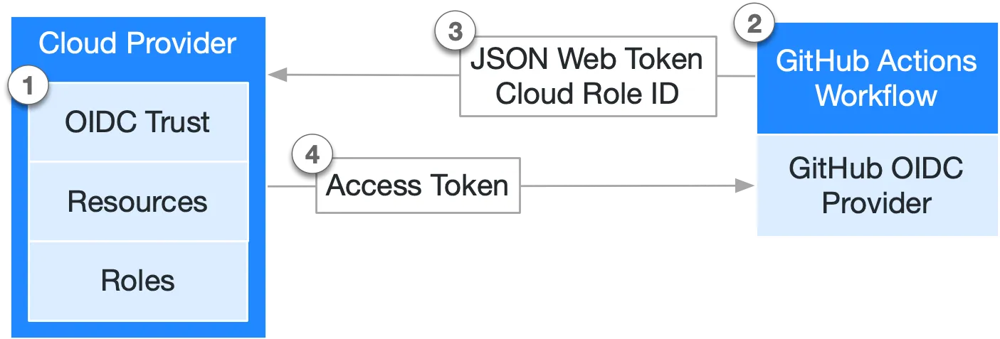

## 🔓 OpenID Connect (OIDC)

OpenID Connect, iş akışlarınızın (workflows) bulut sağlayıcınızdan doğrudan kısa ömürlü belirteçler (tokens) almasına olanak tanır.

### 🌐 OpenID Connect’e Genel Bakış (overview of OpenID Connect – OIDC)

GitHub Actions iş akışları genellikle yazılım dağıtmak veya bulut servislerini kullanmak için bir bulut sağlayıcısına (AWS, Azure, GCP, HashiCorp Vault ve diğerleri) erişmek üzere tasarlanır. İş akışı bu kaynaklara erişmeden önce bulut sağlayıcısına bir kimlik bilgisi (örneğin şifre veya belirteç) iletir. Bu kimlik bilgileri genellikle GitHub’da bir gizli bilgi (secret) olarak saklanır ve iş akışı her çalıştığında bu gizli bilgiyi bulut sağlayıcısına sunar.

Ancak, sabitlenmiş (hardcoded) gizli bilgiler kullanmak, kimlik bilgilerini bulut sağlayıcısında oluşturmanızı ve ardından bunları GitHub’da bir gizli bilgi olarak kopyalamanızı gerektirir.

OIDC’yi destekleyen bir bulut sağlayıcısıyla güven ilişkisi kurduktan sonra, iş akışınızı bulut sağlayıcıdan doğrudan kısa ömürlü bir erişim belirteci istemek üzere yapılandırabilirsiniz.

### ✅ OIDC Kullanmanın Faydaları (benefits of using OIDC)

OIDC belirteçlerini kullanacak şekilde iş akışlarınızı güncelleyerek aşağıdaki güvenlik uygulamalarını benimseyebilirsiniz:

* **Bulut gizlileri yok (no cloud secrets):** Uzun ömürlü GitHub gizlileri olarak bulut kimlik bilgilerinizi kopyalamanıza gerek kalmaz. Bunun yerine, bulut sağlayıcınızda OIDC güvenini yapılandırabilir ve iş akışlarınızı OIDC aracılığıyla kısa ömürlü bir erişim belirteci istemek üzere güncelleyebilirsiniz.
* **Kimlik doğrulama ve yetkilendirme yönetimi (authentication and authorization management):** İş akışlarının kimlik bilgilerini nasıl kullanabileceği üzerinde daha ayrıntılı kontrol elde edersiniz. Bulut sağlayıcınızın kimlik doğrulama (authN) ve yetkilendirme (authZ) araçlarını kullanarak bulut kaynaklarına erişimi yönetebilirsiniz.
* **Kimlik bilgilerini döndürme (rotating credentials):** OIDC ile bulut sağlayıcınız yalnızca tek bir görev (job) için geçerli olan kısa ömürlü bir erişim belirteci verir ve bu belirteç otomatik olarak süresi dolarak geçersiz hale gelir.

### 🔗 OIDC’nin GitHub Actions ile Entegrasyonu (how OIDC integrates with GitHub Actions)

Aşağıdaki diyagram, GitHub’un OIDC sağlayıcısının iş akışlarınız ve bulut sağlayıcınız ile nasıl entegre olduğunu genel hatlarıyla göstermektedir:

*(Diyagram orijinal metinde yer almaktadır.)*




## 🔐 OIDC Güven İlişkisi Kurma ve Belirteç Doğrulama

Bulut sağlayıcısında bir **OIDC güven ilişkisi (trust relationship)** kurarsınız ve bu sayede belirli GitHub iş akışlarının, tanımlı bir bulut rolü (cloud role) adına bulut erişim belirteçleri talep etmesine izin verirsiniz.

Her görev (job) çalıştığında, GitHub’un OIDC sağlayıcısı otomatik olarak bir OIDC belirteci oluşturur. Bu belirteç, kimlik doğrulamaya çalışan belirli iş akışı hakkında güvenliği artırılmış ve doğrulanabilir bir kimlik oluşturmak için çeşitli iddialar (claims) içerir.

Bir iş akışı görevinin içindeki bir adım veya eylem (step/action), GitHub’un OIDC sağlayıcısından bir belirteç talep edebilir ve bu belirteci bulut sağlayıcısına iş akışının kimliğinin kanıtı olarak sunabilir. Bulut sağlayıcısı, belirteçteki iddiaları başarılı bir şekilde doğruladıktan sonra yalnızca görev süresince geçerli olacak kısa ömürlü bir bulut erişim belirteci sağlar.

---

### 🧾 OIDC Belirteci Anlama (understanding the OIDC token)

Her görev, GitHub’un OIDC sağlayıcısından bir OIDC belirteci talep eder. Sağlayıcı, her iş akışı görevi için benzersiz olan otomatik olarak üretilmiş bir **JSON web token (JWT)** ile yanıt verir.

Görev çalıştığında, OIDC belirteci bulut sağlayıcısına sunulur. Bulut sağlayıcısı belirteci doğrulamak için, OIDC belirtecinin `subject` (sub) değeri ve diğer iddiaların, bulut rolünün OIDC güven tanımında önceden yapılandırılmış koşullarla eşleşip eşleşmediğini kontrol eder.

Aşağıdaki örnek OIDC belirteci, `octo-org/octo-repo` deposundaki `prod` adlı bir iş ortamına (job environment) referans veren bir subject (`sub`) kullanmaktadır:

```json
{
  "typ": "JWT",
  "alg": "RS256",
  "x5t": "example-thumbprint",
  "kid": "example-key-id"
}
{
  "jti": "example-id",
  "sub": "repo:octo-org/octo-repo:environment:prod",
  "environment": "prod",
  "aud": "https://github.com/octo-org",
  "ref": "refs/heads/main",
  "sha": "example-sha",
  "repository": "octo-org/octo-repo",
  "repository_owner": "octo-org",
  "actor_id": "12",
  "repository_visibility": "private",
  "repository_id": "74",
  "repository_owner_id": "65",
  "run_id": "example-run-id",
  "run_number": "10",
  "run_attempt": "2",
  "runner_environment": "github-hosted",
  "actor": "octocat",
  "workflow": "example-workflow",
  "head_ref": "",
  "base_ref": "",
  "event_name": "workflow_dispatch",
  "ref_type": "branch",
  "job_workflow_ref": "octo-org/octo-automation/.github/workflows/oidc.yml@refs/heads/main",
  "iss": "https://token.actions.githubusercontent.com",
  "nbf": 1632492967,
  "exp": 1632493867,
  "iat": 1632493567
}
```

---

### ⚙️ Özel Eylemleri OIDC ile Kimlik Doğrulama (authenticating custom actions using OIDC)

Özel eylemler (custom actions), OIDC ile kimlik doğrulamak için **Actions toolkit** içindeki `getIDToken()` yöntemini veya bir `curl` komutunu kullanır.

Daha fazla bilgi için bkz. **OpenID Connect reference**.

---

### 🔄 OIDC İçin İş Akışlarınızı Güncelleme (updating your workflows for OIDC)

GitHub Actions iş akışları, bulut sağlayıcılarıyla kimlik doğrulamak için gizli bilgiler (secrets) yerine OIDC belirteçlerini kullanabilir.

Birçok popüler bulut sağlayıcı, OIDC’yi iş akışlarınızda kullanma sürecini kolaylaştıran resmi giriş eylemleri (login actions) sunar. Belirli bulut sağlayıcılarıyla iş akışlarınızı nasıl güncelleyeceğiniz hakkında daha fazla bilgi için bkz. **Security hardening your deployments**.

---

### 📌 Sonraki Adımlar (next steps)

* OIDC’yi yapılandırma hakkında daha fazla bilgi için bkz. **Security hardening your deployments**.
* OIDC hakkında referans bilgileri için bkz. **OpenID Connect reference**.
