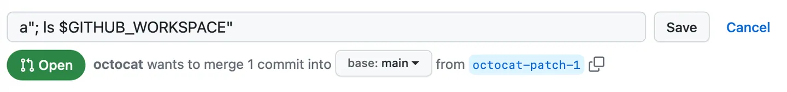

## ⚠️ Script Injections (betik enjeksiyonları)

GitHub Actions iş akışlarında (workflows) betik enjeksiyonlarıyla (script injections) ilişkili güvenlik risklerini anlayın.

---

### 🔍 Betik Enjeksiyonu Riskini Anlamak (understanding the risk of script injections)

İş akışları, özel eylemler (custom actions) ve bileşik eylemler (composite actions) oluştururken, kodunuzun saldırganlardan gelen güvenilmeyen girdileri çalıştırıp çalıştırmayacağını her zaman göz önünde bulundurmalısınız.

Bu durum, bir saldırganın bağlamlara (context) kötü amaçlı komutlar ve betikler eklemesiyle meydana gelebilir. İş akışınız çalıştığında, bu dizeler (strings) kod olarak yorumlanabilir ve çalıştırıcıda (runner) yürütülebilir.

Saldırganlar, **`github` context** içine kötü amaçlı içerikler ekleyebilir. Bu içerikler potansiyel olarak güvenilmez kabul edilmelidir. Genellikle şu alanlarla biterler:

* `body`
* `default_branch`
* `email`
* `head_ref`
* `label`
* `message`
* `name`
* `page_name`
* `ref`
* `title`

Örneğin:

* `github.event.issue.title`
* `github.event.pull_request.body`

Bu değerlerin doğrudan iş akışlarına, eylemlere, API çağrılarına veya çalıştırılabilir kod olarak yorumlanabileceği herhangi bir yere akmasına izin vermemelisiniz. Ayrıcalıklı uygulama kodu için benimsediğiniz savunmacı programlama yaklaşımını burada da kullanarak GitHub Actions kullanımınızı güvence altına alabilirsiniz. Daha fazla bilgi için bkz. **Secure use reference**.

Ek olarak, dal adları (branch names) ve e-posta adresleri gibi daha az bariz fakat potansiyel olarak güvenilmeyen giriş kaynakları da vardır. Bu alanlar oldukça esnek içerikler barındırabilir.

Örneğin:

```
zzz";echo${IFS}"hello";#
```

geçerli bir dal adı olabilir ve hedef depoya saldırı vektörü oluşturabilir.

---

### 💣 Betik Enjeksiyonu Saldırısı Örneği (example of a script injection attack)

Bir betik enjeksiyonu saldırısı, doğrudan bir iş akışının satır içi betiğinde (inline script) gerçekleşebilir.

Aşağıdaki örnekte, bir eylem bir çekme isteği (pull request) başlığının geçerliliğini test etmek için bir ifade kullanır. Ancak aynı zamanda betik enjeksiyonuna karşı savunmasızdır:

```yaml
- name: Check PR title
  run: |
    title="${{ github.event.pull_request.title }}"
    if [[ $title =~ ^octocat ]]; then
    echo "PR title starts with 'octocat'"
    exit 0
    else
    echo "PR title did not start with 'octocat'"
    exit 1
    fi
```

👉 Bu örnek savunmasızdır çünkü `run` komutu, çalıştırıcıda geçici bir kabuk betiği (shell script) içinde yürütülür. Kabuk betiği çalıştırılmadan önce `${{ }}` içindeki ifadeler değerlendirilir ve ortaya çıkan değerlerle değiştirilir. Bu da kabuk komutu enjeksiyonuna açık hale getirir.

Bir saldırgan, aşağıdaki başlığa sahip bir çekme isteği oluşturarak komutları iş akışına enjekte edebilir:

```
a"; ls $GITHUB_WORKSPACE":
```




Örnekte `"` karakteri, `title="${{ github.event.pull_request.title }}"` ifadesini kesmek için kullanılır ve böylece `ls` komutunun çalıştırıcıda yürütülmesine izin verir.

Çalıştırıcı günlüklerinde (logs) şu çıktıyı görebilirsiniz:

```
Run title="a"; ls $GITHUB_WORKSPACE""
README.md
code.yml
example.js
```

---

### 🛡️ En İyi Uygulamalar (best practices)

Çalıştırıcıları güvenli tutmak için önerilen en iyi uygulamalar hakkında bilgi için bkz. **Secure use reference**.
